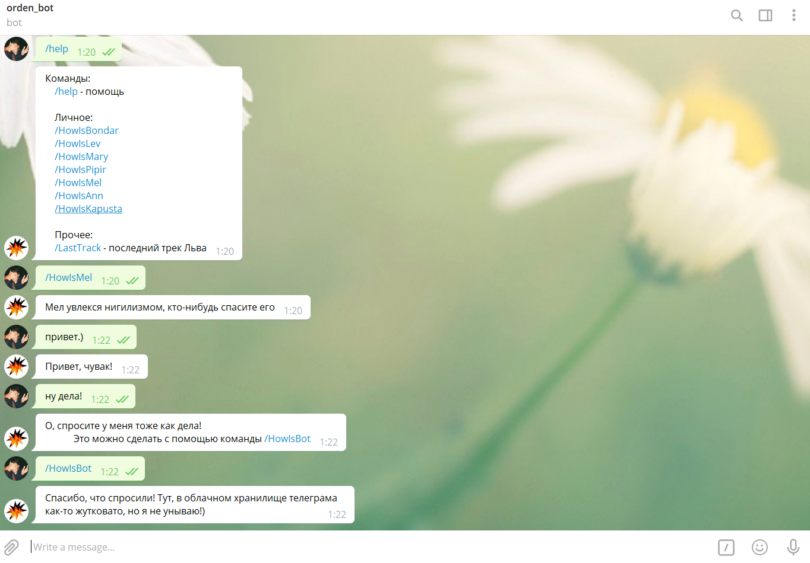
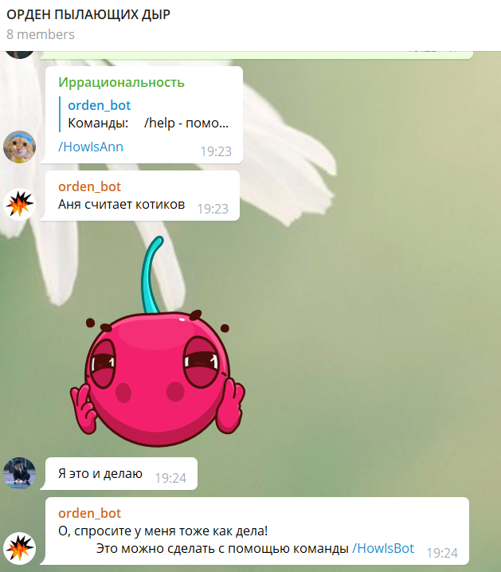

# BurningHoleBot
Телеграм бот, реализованный на php. Проект нужен для изучения php, работы серверов, хостинга и telegram API.
 Сделан для опыта и ради хохмы для чата с друзьями.

<h2>Что умеет это бот?</h2>
 
-отвечать на некоторые сообщения вроде "привет" или "как дела"
 
-в общем чате следит за сообщениями и пытается иногда встревать в диалог, делая замечания
 
-шутит, по команде скидывает смешное видео для друзей
 
-есть кнопки для автоматического заказа вина, которое мы всегда пьем
 
-по команде скидывает последний электронный трек, который сделал создатель Бота

